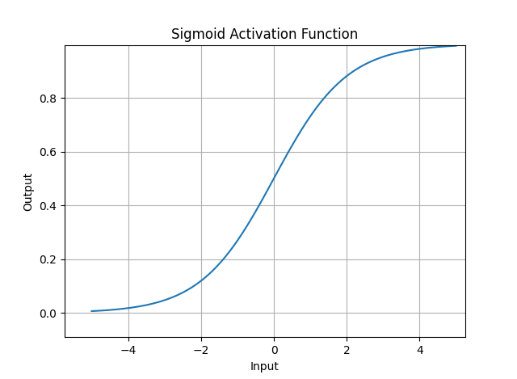

# FUNGSI AKTIVASI (Activation Function)

Fungsi aktivasi merupakan komponen penting
dalam jaringan saraf tiruan. Jadi fungsi ini
menentukan apakah neuron harus diaktifkan
(Menghasilkan nilai) atau tidak, berdasarkan bobot masukannya.

## Sigmoid Activation Function
Rumus :
$$ 
    f(x) = \frac{1}{1+e^{-x}}
$$

```python
import numpy as np
import matplotlib.pyplot as plt

def rumus_sigmoid(x):
    return 1/ (1+np.exp(-x))
#data 
x = np.linspace(-5, 5, 100)
y = rumus_sigmoid(x)

plt.plot(x,y)
plt.xlabel('Input')
plt.ylabel('Output')
plt.title('Sigmoid Activation Function')
plt.grid(True) #ada kotak kotaknya
plt.show()

```
